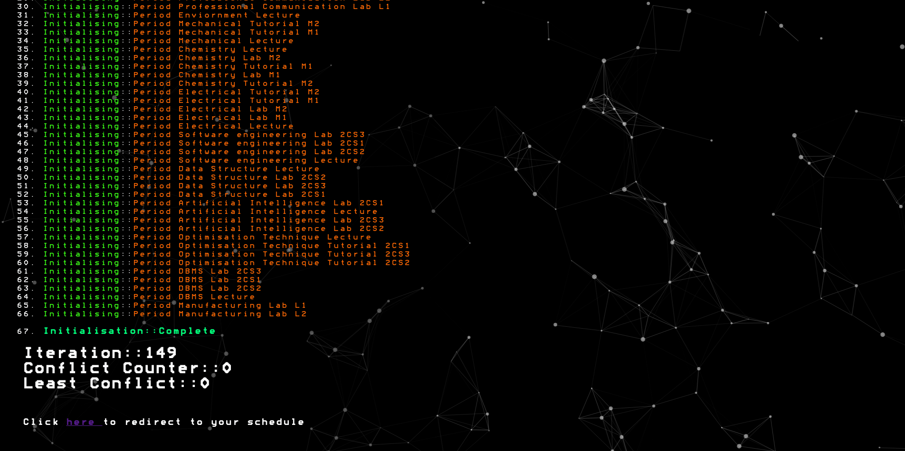

# **College Scheduler**

This is the software engineering project made by me as the semester 4 software engineering project. Its solves the common university problem of having to perfrom tedious scheduling.

* * *

particle.js was used in the waiting page. Credit goes to author.

https://github.com/VincentGarreau/particles.js

* * *

The paper used to impliment the graph coloring is written by Alain Hertz and Nicolas Zufferey. Full credit goes to the author

[https://www.researchgate.net/publication/249906915\_A\_New\_Ant\_Algorithm\_for\_Graph_Coloring](https://www.researchgate.net/publication/249906915_A_New_Ant_Algorithm_for_Graph_Coloring)

* * *

To use locally, follow the below steps.
- Goto frontend and run the build command, make sure the URLBase in src/utils/URLBase.ts is not set to localhost.
- Copy paste the build/static/js, css,media into the build in backend
- In backend folder run build, rename src folder to something else, move all files and folders in dist outside dist
- Copy thapar.json from origina source folder/college scheduler into the new src/college scheduler.
- Create .env file with the following variables => (PORT, WEBTELDBNAME, DBPASS, DBHOST, DBPORT, DBUSER, CollegeScheudlerDBName, JWTEncryptionToken)
- run node index.js

### Do not use this in production, there no row level security so any user can hit the delete end point to delete any resource irrgardless of if it belongs to them or not. 

* * *

Here's how the application works.

* * *

## Database

* * *

## Generate Schedule

Once a user goes to the `/generateSchedule` route, the user loads all their data (i.e. a copy of their entire database entry) as well as the js and wasm file that will be used to generate the schedule on their local machine. The file called scheduler.js is run in parallel as a web worker and given the users info. After turing all the information into a graph, it then calles the ant-colony.js/ant-colony.wasm which in turn the colors the graph. Once the graph is colored the front end sends the coloring as a post request and the backend updates the database. Now the user can view their schedule.

Here's how scheduler.js works

- For each period a node in the graph is initalised.
- For each professor an edge in initalised b/w all the periods taught by the professor
- For each group, an edge is initalised b/w all the periods attended by the group
- For each room an edge is initalised if the period takes place in that room.
- The number b/w \[1 , number of day * number of periods\] also have a unique node created corresponding to them. So say you the university operates for 8 hours and from monday to friday then for each number in the set {1,5 * 8} = {1,40} a node is initalised.
- For each set time an edge b/w all other times and the corresponding period is intialised. So if set-time is tuesday hour 5 for period p, then node 1 * 8 + 5 = node 13, then p will have an edge initalised for all nodes in {1,40} except 13.
- For each ban time the node b/w the time and the corresponding period is intialised. So if ban-time is friday hour 2 for period p, then node 4 * 8 + 5 = node 37 and p have an edge intialised.
- One last contraint is applied. The manufacturing lab is 3 hours long, which means that it cannot be started at periods 7,8 as this would mean that a part of the period will take place the next day. To account for this fact as well, edges are drawn b/w such times and periods which go over one hour. Lets call these edges the continuity constraint

Now to color the graph, the web-assembly used is actually compiled from C++ using emscripten. You can see the C++ code in the ant-colony-cpp folder.

The algorithm used is a minor variation of the algorithm proposed in the following paper. All credits for the algorithm goes to the authors of the paper.

A New Ant Algorithm for Graph Coloring - Alain Hertz and Nicolas Zufferey.

The minor variations are dicussed below

#### Variations in Problem Statment

- We already know the chromatic number with which we intend to color, so we start with it and reduce conflicts
- Certain nodes in the graph cannot have certain colors (the ban-time set-time contraint and the continuity constraint)
- Certain nodes needs to have consequtive colors (since lecture over one hour have a node for each hour)

#### Variations in implimentation

- When the ants are initalised. Every node get ants for colors viable to that node.
- When ants move,then only move from a node which considers their colors to be viable to another node which considers their color viable
- If a node is in conflict, all its sibling nodes (nodes corresponding to the same lecture) get recolored(with consecutive colors).
- In the sorting of moves, they are not just sorted via p(m,t) but rather first they are sorted via how much they reduce conflicts by and then in-place sorting via p(m,t) takes place. This might in an of itself make the algorithm worse, but measure taken to prevent that from happening is dicussed in the next point
- The selection of nodes in not greedy like the paper suggests, but rather probabalistic. After sorting every move has a rank (its index after sorting / total number of moves ). So the to select Nl(x,t-1) moves we randomly generate an index. Now the probability that the move will be selected is given by e -500 rank2. With this probability we select the move, or we discard it. We keep generating random indexes till we get the Nl(x,t-1) moves.This can create a deadlock situation if Nl(x,t-1) is high while the number of moves is low but I never even came close to encountering it . This makes the selection almost greedy, only the top 10% actually get picked, but this method by my observation coupled with the above variation made the algorithm much better.
- pheramon update takes place after coloring has been performed(the paper suggests to do the phermon update before, which seems counter intuitive).
 
Even though the algorithm is single threaded, it never once took over 5 seconds to create the schedule (of thapar even semester 2020)

<b><i>Made by Raghav Kumar</b></i>
